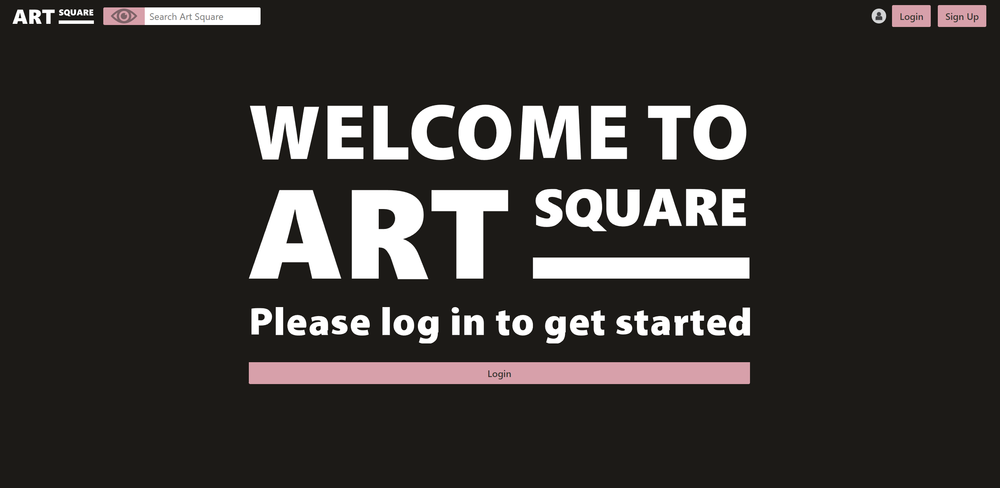
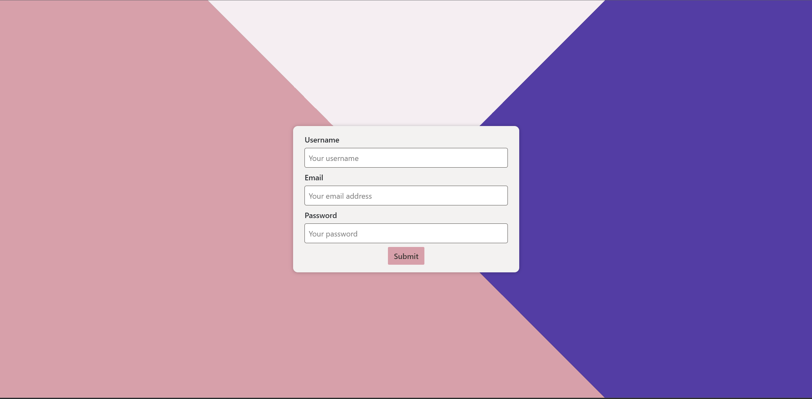
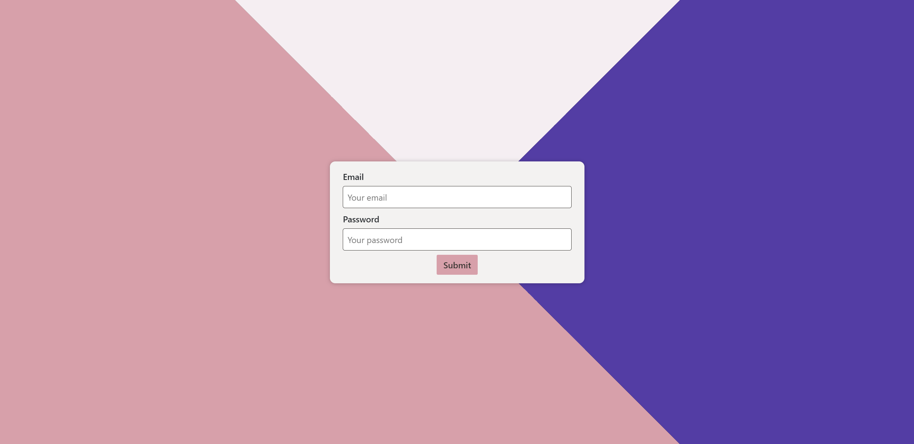
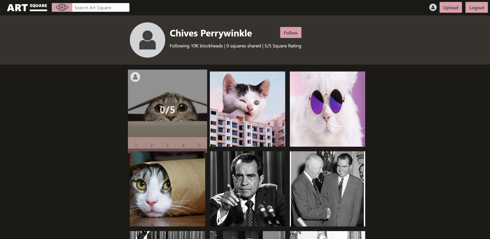

# Art Square

<details>
    <summary><h2>Table of Contents</h2></summary>

- [Art Squre](#art-square)
  - [Description](#description)
  - [License](#license)
  - [Technologies Used](#technologies-used)
  - [Screenshots](#screenshots)
    - [Home Page](#home-page)
    - [Signup Page](#signup-page)
    - [Login Page](#login-page)
    - [Project Page](#project-page)
  - [Run Locally](#run-locally)
  - [Deployed Heroku Link](#deployed-heroku-link)
  - [Acknowledgements](#acknowledgements)
  - [Contributors](#contributors)

</details>

## Description

Getting tired of Instagram? tired of only getting a yes or no response on art that you have been working at nonstop for the last 12 years? Introducing Art Square! Here, your art will be rated 1-5 by the mass population! Getting a more precise idea of how good or bad your art looks could be the difference between you becoming the next Picasso, or becoming straight-up washed-out trash!

## License

[](https://opensource.org/licenses/MIT)

## Technologies Used


## Screenshots

### Home Page


### Signup Page



### Login Page



### Profile Page



## Run Locally

Clone the project

```bash
  git clone (https://github.com/ivyreed/art-square.git)
```

Go to the project directory

```bash
  cd my-project
```

Install dependencies

```bash
  npm install
```

Start the server

```bash
  npm run start
```

## Deployed Heroku Link

This site was deployed using [Heroku](https://art-square-fd6773213118.herokuapp.com/).


## Contributors

- [@Ivy](https://www.github.com/ivyreed)
- [@Jessica](https://github.com/JessDorgu)
- [@Kathyrn](https://github.com/KathyrnY)
- [@Thomas](https://github.com/PrettiestRobot)

[🔼 Back to Top](#marketing-assistant)
